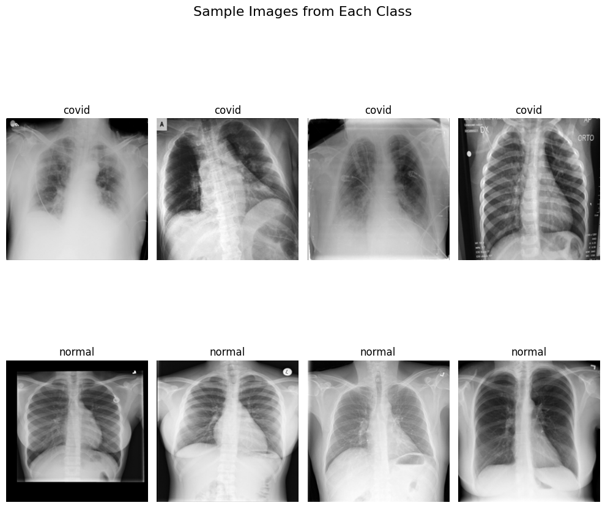

# 🩺 COVID X-Ray Classifier

A deep-learning project for classifying chest X-ray images to detect COVID-19 using multiple convolutional neural network architectures.  
This project demonstrates that **small, task-specific models** can perform effectively, even with limited data, when combined with proper preprocessing and visualization techniques.

---

## 📦 Models Used
The project evaluates and compares the performance of several popular CNN architectures:

- **ResNet18**
- **ResNet50**
- **DenseNet121**
- **EfficientNet-Tiny**

Each model is trained and tested using consistent preprocessing and evaluation methods.

---

## 🧪 Techniques & Methods

### ✔ **Data Handling**
- Dataset divided into:
  - **Training set**
  - **Validation set**
  - **Test set**

### ✔ **Preprocessing & Training Enhancements**
- **Data Augmentation**
  - Rotation  
  - Zoom  
  - Horizontal/Vertical flips  
  - Color/intensity shifts  
- **Dimensionality Reduction**
- **Handling Class Distribution**
- **Confusion Matrix Analysis**
- **Heatmap Visualization**
  - Grad-CAM used to illustrate model attention on relevant lung regions

---

## 🗂 Dataset

The project uses the **COVID-19 Radiography Dataset** containing X-ray images of:
- COVID-19 patients
- Viral pneumonia
- Lung opacity
- Normal lungs
  ## 📷 Data Visualization (Grad-CAM / Predictions)





📥 **Dataset link:**  
(Requires Google Drive access)  
<https://drive.google.com/drive/folders/1-9Pl-PRkj7GROiJ2rEGMTLp2bfge2Yzn?usp=sharing>

---

## 🚀 Project Goal & Summary

> “In today’s world, many people believe that achieving a better model requires more resources: more training, more data collection, and more computation.  
> But this project shows that even **small models** can successfully converge and perform well—even on difficult datasets—when proper techniques such as data augmentation are applied.  
> Using Grad-CAM, we confirmed that the model focuses on the correct regions in X-ray images.  
>   
> So the question is this: **Is it truly necessary to spend huge amounts of money on large, general-purpose models that deliver medium accuracy while demanding massive cost and human effort?  
> Or should we focus on smaller, specialized models that deliver high accuracy at low computational cost?**”

---

## 🔧 Installation & Usage

### 1️⃣ Clone the repository:
```bash
git clone https://github.com/USERNAME/covid-xray-classifier.git
cd covid-xray-classifier

